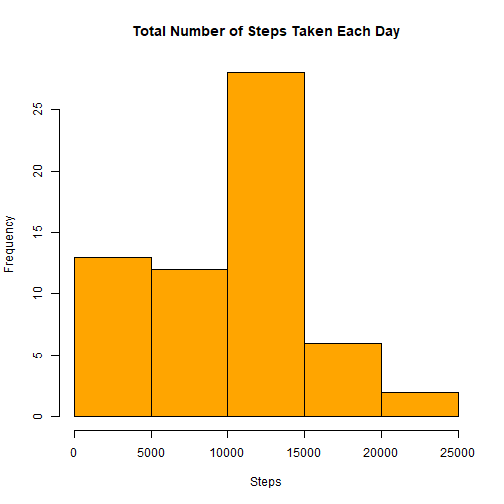
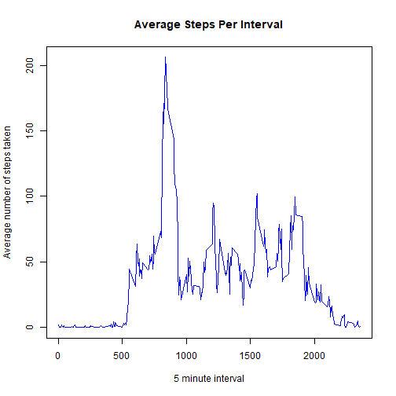
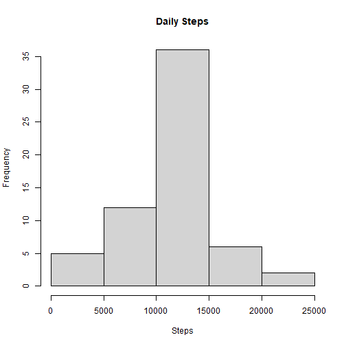
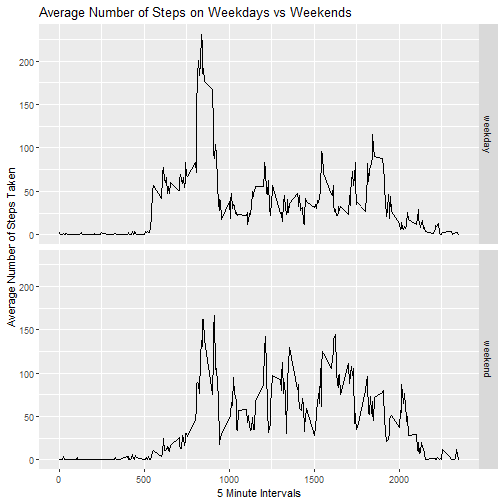

## Loading and pre-processing the data


```r
if(!file.exists("./data")){dir.create("./data")}
fileUrl <- "https://d396qusza40orc.cloudfront.net/repdata%2Fdata%2Factivity.zip"
download.file(fileUrl,destfile="./data/activity.zip",method="curl")

unzip(zipfile="./data/activity.zip",exdir="./data")
activity <- read.csv("./data/activity.csv")
activity$date <- as.Date(activity$date)
```


## What is the mean total number of steps taken per day?

1. Calculate the total number of steps taken per day


```r
library(dplyr)
```

```
## 
## Attaching package: 'dplyr'
```

```
## The following objects are masked from 'package:stats':
## 
##     filter, lag
```

```
## The following objects are masked from 'package:base':
## 
##     intersect, setdiff, setequal, union
```

```r
StepsPerDay <- activity %>%
        group_by(date) %>%
        summarise(TotalSteps = sum(steps, na.rm = TRUE))
head(StepsPerDay, 10)
```

```
## # A tibble: 10 x 2
##    date       TotalSteps
##    <date>          <int>
##  1 2012-10-01          0
##  2 2012-10-02        126
##  3 2012-10-03      11352
##  4 2012-10-04      12116
##  5 2012-10-05      13294
##  6 2012-10-06      15420
##  7 2012-10-07      11015
##  8 2012-10-08          0
##  9 2012-10-09      12811
## 10 2012-10-10       9900
```

2. Make a histogram of the total number of steps taken each day


```r
hist(StepsPerDay$TotalSteps, 
     xlab = "Steps", col = "orange", 
     main = "Total Number of Steps Taken Each Day")
```



3. Calculate and report the meman and median of the total number of steps taken per day


```r
StepsMean <- mean(StepsPerDay$TotalSteps)
print(paste("The mean is", StepsMean))
```

```
## [1] "The mean is 9354.22950819672"
```

```r
StepsMedian <- median(StepsPerDay$TotalSteps)
print(paste("The median is", StepsMedian))
```

```
## [1] "The median is 10395"
```


## What is the average daily activity pattern?

1. Make a time series plot (i.e. type = "l") of the 5-minute interval (x-axis) and the average number of steps taken, averaged across all days (y-axis)


```r
StepsPerInterval <- activity %>%
        group_by(interval) %>%
        summarise(averagesteps = mean(steps, na.rm = TRUE))

plot(StepsPerInterval$averagesteps ~ StepsPerInterval$interval,
     main = "Average Steps Per Interval", type ="l", col = "blue",
     xlab = "5 minute interval", ylab = "Average number of steps taken")
```



2. Which 5-minute interval, on average across all the days in the dataset, contains the maximum number of steps?


```r
IntervalWithMaxSteps <- StepsPerInterval$interval[which.max(StepsPerInterval$averagesteps)]
print(IntervalWithMaxSteps)
```

```
## [1] 835
```


## Imputing missing values

1. Calculate and report the total number of missing values in the dataset (i.e. the total number of rows with NAs)


```r
RowsWithNA <- sum(is.na(activity$steps))
print(paste("The total number of rows with NA is", RowsWithNA))
```

```
## [1] "The total number of rows with NA is 2304"
```

2. Devise a strategy for filling in all of the missing values in the dataset. The strategy does not need to be sophisticated. 
For example, you could use the mean/median for that day, or the mean for that 5-minute interval, etc.

The strategy chosen for filling in all the missing values in the dataset is to use the mean for that 5-minute interval


3. Create a new dataset that is equal to the original dataset but with the missing data filled in.


```r
head(activity, 10)
```

```
##    steps       date interval
## 1     NA 2012-10-01        0
## 2     NA 2012-10-01        5
## 3     NA 2012-10-01       10
## 4     NA 2012-10-01       15
## 5     NA 2012-10-01       20
## 6     NA 2012-10-01       25
## 7     NA 2012-10-01       30
## 8     NA 2012-10-01       35
## 9     NA 2012-10-01       40
## 10    NA 2012-10-01       45
```

```r
ActivityWithoutNa <- activity
  for (i in 1:nrow(activity)){
      if(is.na(activity$steps[i])){
          ActivityWithoutNa$steps[i] <- StepsPerInterval$averagesteps[ActivityWithoutNa$interval[i] == StepsPerInterval$interval]
      }
  }  

head(ActivityWithoutNa, 10)
```

```
##        steps       date interval
## 1  1.7169811 2012-10-01        0
## 2  0.3396226 2012-10-01        5
## 3  0.1320755 2012-10-01       10
## 4  0.1509434 2012-10-01       15
## 5  0.0754717 2012-10-01       20
## 6  2.0943396 2012-10-01       25
## 7  0.5283019 2012-10-01       30
## 8  0.8679245 2012-10-01       35
## 9  0.0000000 2012-10-01       40
## 10 1.4716981 2012-10-01       45
```

4. Make a histogram of the total number of steps taken each day and Calculate and report the mean and median total number of steps taken per day. Do these values differ from the estimates from the first part of the assignment? What is the impact of imputing missing data on the estimates of the total daily number of steps?


```r
StepsPerDay2 <- ActivityWithoutNa %>%
        group_by(date) %>%
        summarize(TotalSteps2 = sum(steps, na.rm = TRUE))
head(StepsPerDay2, 10)
```

```
## # A tibble: 10 x 2
##    date       TotalSteps2
##    <date>           <dbl>
##  1 2012-10-01      10766.
##  2 2012-10-02        126 
##  3 2012-10-03      11352 
##  4 2012-10-04      12116 
##  5 2012-10-05      13294 
##  6 2012-10-06      15420 
##  7 2012-10-07      11015 
##  8 2012-10-08      10766.
##  9 2012-10-09      12811 
## 10 2012-10-10       9900
```

```r
hist(StepsPerDay2$TotalSteps2, xlab = "Steps", main = "Daily Steps")
```



```r
StepsMeanNoNA <- mean(StepsPerDay2$TotalSteps2)
print(paste("The mean is", StepsMeanNoNA))
```

```
## [1] "The mean is 10766.1886792453"
```

```r
StepsMedianNoNA <- median(StepsPerDay2$TotalSteps2)
print(paste("The median is", StepsMedianNoNA))
```

```
## [1] "The median is 10766.1886792453"
```
Imputing the missing data produced different values which increased both the mean and median of the total daily steps.


## Are there differences in activity patterns between weekdays and weekends?

1. Create a new factor variable in the dataset with two levels – “weekday” and “weekend” indicating whether a given date is a weekday or weekend day.


```r
ActivityWithoutNa$date <- as.Date(ActivityWithoutNa$date)
ActivityWithoutNa$day <- ifelse(weekdays(ActivityWithoutNa$date) %in% c("Saturday", "Sunday"), "weekend", "weekday")
ActivityWithoutNa$day <- as.factor(ActivityWithoutNa$day)
```

2. Make a panel plot containing a time series plot (i.e. type=“l”) of the 5-minute interval (x-axis) and the average number of steps taken, averaged across all weekday days or weekend days (y-axis).


```r
dayTypeData <- aggregate(steps ~ interval + day, data = ActivityWithoutNa, mean)
library(ggplot2)
ggplot(dayTypeData, aes(interval, steps)) +
  geom_line() +
  facet_grid(day ~ .) +
  xlab("5 Minute Intervals") +
  ylab("Average Number of Steps Taken") +
  ggtitle("Average Number of Steps on Weekdays vs Weekends")
```




